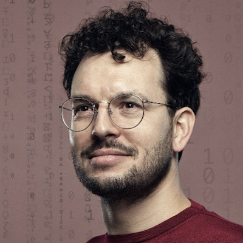

# Het team

<!-- markdownlint-disable MD030 MD033 -->

-   ## Kees Keulemans

    Kwartiermaker

    ----

-   ## Patrick Knoester

    Kwartiermaker

    ----

-   ## Eelco Hotting

    Adviseur

    ----

-   ## Lucas Klostermann

    Architect

    ----

-   ## Maro Pas

    Architect

    ----
    
-   ## Victor den Toom

    Architect

    ----

-   ## Anne Schuth

    Engineer

    ----

    {: .round }

    Anne is engineer in Bureau Architectuur. Anne was hiervoor Engineering Manager bij Spotify en werkte bij DPG Media,
    Google AI, en Blendle. Hij promoveerde aan de Universiteit van Amsterdam op het gebied van zoekmachine technologie.

    [:fontawesome-brands-github: anneschuth](https://github.com/anneschuth)

    [:fontawesome-brands-linkedin: Anne Schuth](https://linkedin.com/in/AnneSchuth)

    [:octicons-link-24: anneschuth.nl](https://anneschuth.nl)

